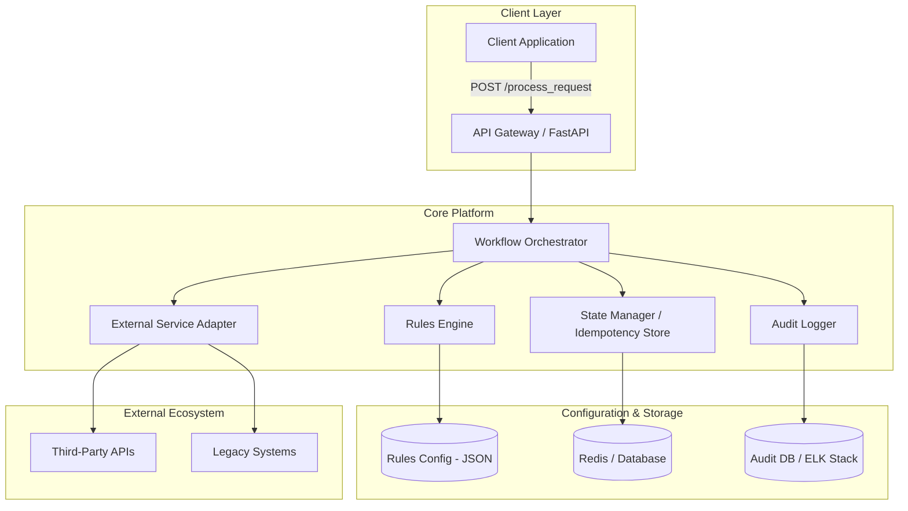

# Architecture Document: Configurable Workflow Decision Platform

## 1. System Overview
The **Configurable Workflow Decision Platform** is a high-performance, modular system designed to automate complex business decisions (e.g., credit approvals, fraud detection, or claim processing). It allows users to define decision logic via JSON configurations, ensuring that business rules can be updated without code changes. The platform prioritizes reliability through built-in idempotency, retry mechanisms, and a comprehensive audit trail.

## 2. Architecture Diagram

## 3. Component Descriptions

### 3.1 API Layer (FastAPI)
Acts as the entry point for all requests. It performs schema validation using Pydantic and handles authentication/authorization.

### 3.2 Workflow Orchestrator
The "brain" of the system. It manages the lifecycle of a request, transitioning it through predefined stages: `request_received` -> `validation` -> `rule_evaluation` -> `decision_stage`.

### 3.3 Rules Engine
A decoupled component that evaluates business logic against the request payload. It supports field comparisons, logical operators, and conditional branching (nested rules).

### 3.4 State Manager (Idempotency)
Ensures that the same request (identified by a `request_id`) is not processed multiple times. It stores the final result of a workflow and returns it immediately if a duplicate request arrives.

### 3.5 External Service Adapter
Handles communication with external dependencies. It implements the **Retry Pattern** with exponential backoff and provides a fallback to `manual_review` if external systems are unreachable.

### 3.6 Audit Logger
Captures every state transition and decision point. This provides full observability for debugging and regulatory compliance.

## 4. Data Flow
1. **Ingestion**: Client sends a JSON payload with a unique `request_id`.
2. **Idempotency Check**: State Manager checks if `request_id` exists. If yes, returns cached result.
3. **Validation**: Orchestrator validates payload structure and mandatory fields.
4. **Rule Evaluation**: Rules Engine loads JSON config and determines the path (e.g., Approve, Reject, or proceed to External Call).
5. **Execution**: If required, External Adapter calls third-party APIs with a 3-retry limit.
6. **Decision**: Final outcome is determined.
7. **Persistence**: Result and Audit Trail are saved.
8. **Response**: Final decision is returned to the client.

## 5. Scalability Considerations
- **Horizontal Scaling**: The API and Orchestrator are stateless and can be scaled across multiple containers/pods.
- **Distributed State**: While current implementation is in-memory, moving to **Redis** for the Idempotency Store allows for multi-node consistency.
- **Asynchronous Processing**: For long-running workflows, the system can transition to a **Task Queue (Celery/RabbitMQ)** model where the client receives a `202 Accepted` and polls for results.
- **Database Partitioning**: Audit logs can grow rapidly; partitioning by `workflow_type` or `date` is recommended.

## 6. Trade-offs and Assumptions

### 6.1 Trade-offs
- **JSON vs. Code Rules**: Using JSON for rules increases flexibility for non-developers but adds a small parsing overhead compared to hardcoded Python logic.
- **Synchronous vs. Asynchronous**: The current sync-over-async model provides immediate feedback but may hold connections open during long retries.
- **In-Memory Store**: Chosen for simplicity in the prototype; requires a persistent database (PostgreSQL/Redis) for production reliability.

### 6.2 Assumptions
- **Unique Request IDs**: Clients are responsible for generating globally unique IDs for idempotency to work correctly.
- **Stateless Rules**: Rules only depend on the current request payload and do not require historical context (unless provided in the payload).
- **Network Reliability**: External calls are assumed to be the most common point of failure, hence the heavy focus on retry logic.
